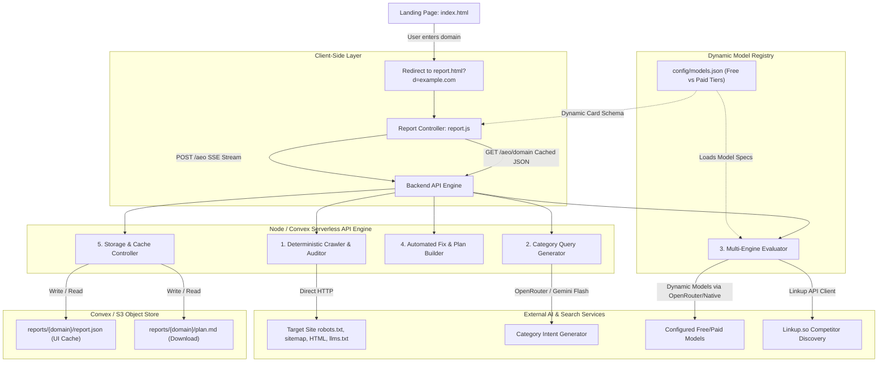

# AEO Ready (AEOReady.xyz) — Solution Architecture & Development Plan (v1)

This document outlines the technical architecture and step-by-step development plan for **v1 of AEO Ready**. 

Key architectural requirements:
1. **Dedicated Report Page (`report.html`)**: Score and all outputs are displayed on a separate page with shareable permalinks (`/report.html?d=domain.com`).
2. **Config-Driven Model Execution (`config/models.json`)**: Models to execute and their corresponding UI result cards are **never hardcoded**; they are dynamically driven by a configuration file supporting instant model additions, swaps, and tier assignments ((a) Free Tier and (b) Paid Tier).
3. **S3 / Convex Storage Persistence**: Assessments, scores, and downloadable Markdown plans are persisted to object/database storage for instant 7-day cached retrieval ($0 LLM cost).

---

## 1. High-Level Architecture Overview



---

## 2. Dynamic Model Configuration Specification (`config/models.json`)

To prevent tech debt and enable rapid model updates without code deployments, the evaluation suite is 100% config-driven.

### Schema (`config/models.json`):
```json
{
  "version": "1.0",
  "tiers": {
    "free": [
      {
        "id": "gemini-flash",
        "name": "Google Gemini",
        "modelId": "google/gemini-2.0-flash-001",
        "provider": "openrouter",
        "badge": "Fast",
        "accentColor": "#38bdf8",
        "maxTokens": 350,
        "enabled": true
      },
      {
        "id": "chatgpt-mini",
        "name": "OpenAI ChatGPT",
        "modelId": "openai/gpt-4o-mini",
        "provider": "openrouter",
        "badge": "Fast",
        "accentColor": "#10a37f",
        "maxTokens": 350,
        "enabled": true
      },
      {
        "id": "claude-haiku",
        "name": "Anthropic Claude",
        "modelId": "anthropic/claude-3-haiku",
        "provider": "openrouter",
        "badge": "Fast",
        "accentColor": "#c084fc",
        "maxTokens": 350,
        "enabled": true
      }
    ],
    "paid": [
      {
        "id": "claude-sonnet",
        "name": "Claude 3.7 Sonnet",
        "modelId": "anthropic/claude-3.7-sonnet",
        "provider": "openrouter",
        "badge": "Frontier",
        "accentColor": "#c084fc",
        "maxTokens": 500,
        "enabled": true
      },
      {
        "id": "chatgpt-terra",
        "name": "ChatGPT 5.6 Terra",
        "modelId": "openai/gpt-5.6-terra",
        "provider": "openrouter",
        "badge": "Frontier",
        "accentColor": "#10a37f",
        "maxTokens": 500,
        "enabled": true
      },
      {
        "id": "grok",
        "name": "xAI Grok 4.6",
        "modelId": "x-ai/grok-4.6",
        "provider": "openrouter",
        "badge": "Real-time",
        "accentColor": "#f8fafc",
        "maxTokens": 500,
        "enabled": true
      },
      {
        "id": "gemini-pro",
        "name": "Gemini 3.1 Pro",
        "modelId": "google/gemini-2.5-pro",
        "provider": "openrouter",
        "badge": "Frontier",
        "accentColor": "#38bdf8",
        "maxTokens": 500,
        "enabled": true
      },
      {
        "id": "perplexity-sonar",
        "name": "Perplexity Sonar",
        "modelId": "perplexity/sonar",
        "provider": "openrouter",
        "badge": "Live Web",
        "accentColor": "#22d3ee",
        "maxTokens": 500,
        "enabled": true
      }
    ]
  }
}
```

### Dynamic Pipeline Benefits:
1. **Zero-Code Model Swapping:** Changing from `claude-3-haiku` to `claude-3.5-haiku` or updating model IDs takes **1 line in `models.json`**.
2. **Dynamic UI Rendering:** The report page (`report.js`) renders engine cards dynamically from the stream payload without any hardcoded card HTML.
3. **Tier Flexibility:** Adding a new tier (e.g. `enterprise` with 10 models) requires only adding a new array in `models.json`.

---

## 3. Dedicated Report Page Architecture (`report.html` & `report.js`)

### URL Structure
- **New Run:** Navigating to `report.html?d=supabase.com` triggers the live assessment stream.
- **Cached Report View:** Visiting `report.html?d=supabase.com` instantly fetches the cached JSON (`GET /aeo/supabase.com`) from S3/Convex and renders in **< 20ms** at **$0.00 LLM cost**.
- **Force Fresh Scan:** Visiting `report.html?d=supabase.com&refresh=true` invalidates cache and triggers a fresh live run.

### Report Page Sections & Layout:
1. **Sticky Top Navigation:**
   - Left: `AEO Ready` brand logo & mark.
   - Center: Scanned Domain Badge (e.g. `weaviate.io`) with timestamp & "⚡ CACHED" / "LIVE" tag.
   - Right: "↻ Re-run Scan" and "New Domain →" buttons.
2. **Hero Score Card:**
   - Radial Score Ring (0–100) + Grade Band (`GRADE A / B / C / D`).
   - 5 Horizontal Pillar Progress Bars:
     - 1. Technical Crawler Access (`robots.txt`, bot allowlists) — 20 pts
     - 2. Structured Schema (JSON-LD validation) — 25 pts
     - 3. Agent Surfaces & Endpoints (`llms.txt`, Content Signals) — 20 pts
     - 4. Content Clarity & Hierarchy (`h1`, `h2`, opening summary) — 15 pts
     - 5. Engine Visibility (Live model citation share) — 20 pts
3. **One-Click Downloadable Plan Card:**
   - **`[ Download .md Plan ]`** button fetching `GET /aeo/:domain/plan.md`.
   - Formatted specifically for pasting into Claude Code, Cursor, or Codex.
4. **Dynamic AI Radar Breakdown (Driven by `models.json`):**
   - Side-by-side cards rendered dynamically for every model returned by the backend.
   - Shows **Engine Name**, **Model Badge**, **Mention Rate %**, **Citation Rate %**, and **Performance Band**.
5. **Buyer-Intent Query Chips:**
   - Category questions tagged with green/red status badges for each engine.
6. **Ranked Remediation & Fix Cards:**
   - Section: *"10 things to fix, most damaging first"*
   - Categorized by Severity: `CRITICAL` (Orange), `HIGH` (Blue), `MEDIUM` (Purple).
   - Interactive copy-paste code snippets (JSON-LD Schema, `robots.txt` diffs, `llms.txt`).
7. **"Who Else Got Cited" (Competitor Cohort):**
   - Competitor citation share ranking showing which brands AI models recommended.
8. **Linkup Pro Competitor Section:**
   - Deep competitor gap analysis (or upgrade unlock).

---

## 4. Backend Pipeline Specification (`server.js` & `lib/`)

```
aeo/
├── config/
│   └── models.json         # Dynamic Free & Paid model configurations
├── convex/
│   ├── schema.ts           # Convex database schema (assessments, users)
│   └── assessments.ts      # Reactive queries, mutations & background actions
├── lib/
│   ├── crawler.js          # Direct HTTP fetcher (robots.txt, sitemap, HTML, headers)
│   ├── audit.js            # Deterministic math for Pillars A, B, C, D
│   ├── queries.js          # Category & buyer-intent query generator
│   ├── engines.js          # Multi-model evaluator reading dynamically from models.json
│   ├── fixes.js            # Remediation code generator (JSON-LD, llms.txt, robots.txt)
│   ├── plan.js             # Compiles markdown fix plan (plan.md)
│   ├── linkup.js           # Linkup search client for competitor discovery
│   └── storage.js          # S3 / Cloudflare R2 / Local cache controller
└── server.js               # Node HTTP server & SSE endpoint routing
```

---

## 5. Summary Confirmation

| Requirement | Implementation Approach |
|---|---|
| **Models NOT Hardcoded** | Centrally configured in `config/models.json` |
| **Free vs Paid Tier Model Lists** | `tiers.free` and `tiers.paid` arrays in `config/models.json` |
| **Dynamic UI Result Cards** | `report.js` loops over streamed engine payloads with `auto-fit` grid |
| **Dedicated Report Page** | `report.html` with clean permalink routing (`?d=domain.com`) |
| **Storage & 7-Day Caching** | S3 / Convex file storage + cached JSON API |
| **No-Code Model Updates** | Modify `config/models.json` $\rightarrow$ instantly reflects across backend & frontend |
